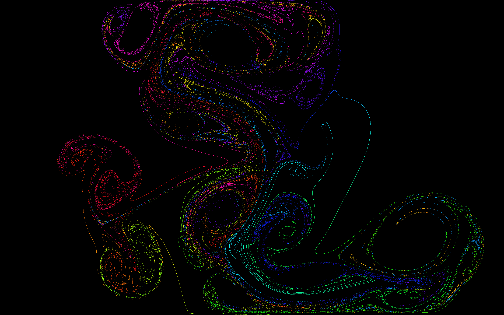

# Interactive 2D GPGPU Fluid simulation
This project uses OpenGL's compute shaders to simulate fluid.

Install `cargo` from [rustup.rs](https://rustup.rs), then use `cargo run` to compile and run the project.

## Details
* Particles are stepped according to a velocity field
* Velocity field is simulated via the Eularian method with Semi-lagrangian advection
    * The Jacobi scheme is used to relax to the incompressible solution
    * A staggered grid is used to simplify the relaxation scheme
